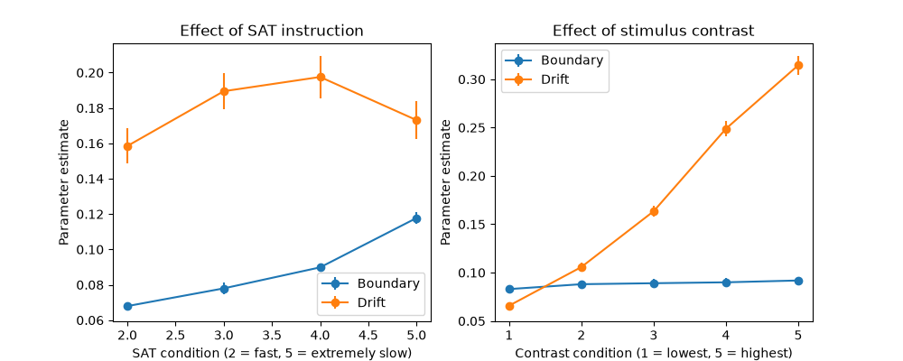

# Selective Influence in the Drift-Diffusion Model: Speed-Accuracy Instructions and Stimulus Contrast

I tested whether visual clarity and decision pressure affect separate parts of how people make decisions.

What I found was that visual clarity separated really cleanly: it changed how quickly evidence built up without really changing how cautious people were. Decision pressure changed caution as expected, but its effect wasn't completely separate from evidence accumulation.

## Background

The Drift Diffusion Model (DDM) is a computational model used to understand how people make decisions (Ratcliff, 1978). The basic idea is that we gradually gather evidence until there is enough to make a choice. Drift describes the rate and quality of that evidence accumulation, and boundary describes how much evidence someone needs before they are willing to make that choice (Wagenmakers et al., 2007).

What I find useful about the DDM is that reaction time and accuracy can tell us what someone did, but not necessarily why they did it. A slower response, for example, could mean that the evidence was difficult to process. It could also mean that someone was simply being more cautious. The DDM gives us a way to try to separate those processes.

There is experimental evidence behind these interpretations. Voss et al. (2004) found that making stimuli harder to discriminate reduced drift, while encouraging participants to prioritise accuracy increased their decision threshold. Forstmann et al. (2008) also found that putting people under greater speed pressure lowered the estimated response threshold. Together, these findings support the idea that stimulus quality and decision strategy can affect different parts of the decision process.

But whether that separation holds cleanly has been debated. Rafiei & Rahnev (2021) found substantial violations of selective influence in this dataset, while Ratcliff & Kang (2021) later argued that fast guesses were responsible for much of that pattern and recovered selective influence using a diffusion/fast-guess mixture model.

That is what I wanted to re-examine here. I looked at two things: how clear the visual stimulus was, and whether participants were being pushed towards speed or accuracy. If these really affect separate parts of the decision process, changing contrast should mainly affect drift, and changing speed–accuracy instructions should mainly affect boundary.

## Method

I analysed the Rafiei & Rahnev (2021) behavioural dataset, which contains 100,000 trials from 20 participants. Each participant completed trials across five stimulus-contrast levels and five speed–accuracy trade-off (SAT) conditions.

Before fitting the model, I removed reaction times below 300 ms. This was not an arbitrary cutoff. Ratcliff & Kang's (2021) reanalysis of the same dataset found that responses below 300 ms remained at chance accuracy, suggesting that many of these very fast responses were guesses rather than evidence-based decisions. After applying the cutoff, 82,944 trials remained.

One condition needed some extra consideration. SAT 1 asked participants to respond extremely quickly, and 63.6% of its trials fell below the 300 ms cutoff. Some participant × condition cells were left with as few as four trials, which made the resulting EZ-diffusion estimates unreliable. I therefore kept SAT 1 in the descriptive analysis, but excluded it from the formal selective-influence test. This is also consistent with Ratcliff & Kang's (2021) decision to restrict their diffusion-model analysis to the four slower SAT conditions.

For each participant × SAT × Contrast condition, I calculated accuracy, mean reaction time, reaction-time variance and trial count. I then used these summary statistics to estimate drift, boundary and non-decision time with the EZ-diffusion model (Wagenmakers et al., 2007).

Before trusting EZ-diffusion on the real data, I wanted to make sure it was actually recovering what I thought it was. I simulated trials using drift and boundary values I already knew, then checked whether the model could recover them. I also added a known non-decision time to make the test harder, because recovering a value close to zero felt like a pretty weak test on its own.

The model recovered the parameters closely in both cases. More importantly, the process caught two mistakes in my implementation: the simulator and model were using different scaling conventions, and I had defined boundary separation incorrectly. I fixed both, reran the recovery tests, and only moved on to the real dataset once the results held.

## Results

Contrast gave the clearest evidence of selective influence. Mean drift increased from 0.066 at the lowest contrast to 0.314 at the highest, almost a five-fold increase. Boundary, on the other hand, barely changed across the same conditions (0.083–0.092). Making the stimulus easier to see therefore had a large effect on evidence accumulation without producing the same change in response caution.

The SAT manipulation showed a different pattern. Boundary increased steadily from 0.068 in SAT 2 to 0.118 in SAT 5, which is what we would expect as participants moved from prioritising speed towards prioritising accuracy. Drift was less straightforward. It increased across SAT 2–4 before dropping again at SAT 5, rather than remaining completely stable.

Taken together, the two manipulations do not produce a perfect double dissociation. Contrast affected drift very strongly and left boundary almost untouched, but SAT did not leave drift completely unchanged. I therefore interpret the results as evidence for selective influence, with the Contrast effect providing the cleaner separation.

*Left: Boundary increases as the instructions place greater emphasis on accuracy. Drift also varies across SAT conditions. Right: Drift increases strongly with stimulus contrast, whereas boundary remains relatively stable. Error bars show ±1 SEM across participants.*

## Limitations

The main complication in the results is the variation in drift across SAT conditions. One possibility was that some very fast guesses were still affecting the faster SAT conditions even after the 300 ms cutoff. I tested this by repeating the analysis with a stricter 400 ms cutoff.

That changed the pattern in an interesting way. Drift across SAT 2–4 became almost flat, but the drop at SAT 5 remained. The main Contrast result and the boundary estimates were also stable. This suggests that fast responses contributed to some of the original SAT–drift variation, but they do not explain all of it.

There is also an important difference between this analysis and Ratcliff & Kang's (2021) approach. Rather than relying on an RT cutoff alone, they explicitly modelled fast guesses as a separate process alongside the diffusion process. Their fitted mixture model recovered selective influence, with stimulus contrast affecting drift and speed–accuracy stress leaving drift unchanged. This gives a more precise way of accounting for fast guesses than my threshold-based sensitivity analysis, and may help explain why their separation was cleaner.

I therefore cannot rule out either explanation for the remaining SAT–drift variation: some contamination may still remain, or decision pressure may have had a genuine effect on evidence accumulation.

EZ-diffusion itself is also a simplified analytical version of the diffusion model. It is useful here because it allows drift, boundary and non-decision time to be estimated directly from accuracy and reaction-time summary statistics, but those estimates should not be treated as equivalent to parameters from a full hierarchical diffusion-model fit.

## References

Forstmann, B. U., Dutilh, G., Brown, S., Neumann, J., von Cramon, D. Y., Ridderinkhof, K. R., & Wagenmakers, E.-J. (2008). Striatum and pre-SMA facilitate decision-making under time pressure. Proceedings of the National Academy of Sciences, 105(45), 17538–17542.

Rafiei, F., & Rahnev, D. (2021). Qualitative speed-accuracy tradeoff effects that cannot be explained by the diffusion model under the selective influence assumption. Scientific Reports, 11, 45.

Ratcliff, R. (1978). A theory of memory retrieval. Psychological Review, 85, 59–108.

Ratcliff, R., & Kang, I. (2021). Qualitative speed-accuracy tradeoff effects can be explained by a diffusion/fast-guess mixture model. Scientific Reports, 11, 15169.

Voss, A., Rothermund, K., & Voss, J. (2004). Interpreting the parameters of the diffusion model: An empirical validation. Memory & Cognition, 32(7), 1206–1220.

Wagenmakers, E.-J., van der Maas, H. L. J., & Grasman, R. P. P. P. (2007). An EZ-diffusion model for response time and accuracy. Psychonomic Bulletin & Review, 14(1), 3–22.